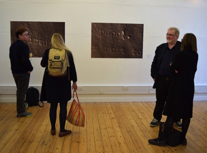

## The Poetics of the Archive: Creative and Community Engagement with the Bloodaxe Archive ##

_Image: Macro photographs by Phyllis Christopher of details from the Bloodaxe Archive_

This project brought a number of processes into the same time frame that one might have expected to be ordered sequentially. At first this was simply a practical matter: archival materials were being received from the poetry publisher, Bloodaxe Books, to be sorted and listed and eventually catalogued, at the same time as our thirty-five participants, both poets and artists, had to begin their scrutiny of the archive and plan the work they wanted to make in response to it. One participant commented on her surprise that ‘the packets of proofs and correspondence were still enclosed in original stamped envelopes that felt like relics in their tattiness’. Gradually, however, this ‘tattiness’ became essential to our thinking as we tried to find ways of reproducing the process of writing in our project and interrogate the division between the material and the digital. Digital macro-photographs of the proofs and pages from Bloodaxe revealed a resemblance between paper and skin, as well as the ghostly traces of the poet’s workings, hidden under coffee stains or tipp-ex.  Derrida has argued that the digital liberates the ‘past resources of paper’; its adventures provide us with ‘a sort of future anterior’ (Paper Machine, p. 47). The photos seemed to exemplify this argument precisely, revealing things that we could not see without digital enhancement, but which were already there.

The desire to make visible the archiving process as active, ‘live’, was also behind Tom Schofield’s development of a ‘Marginalia Machine’, a drawing machine that reproduced notes from the Bloodaxe Archive. As new documents were digitised, a computer programme separated the notes from the background text. The resulting notes were then drawn publicly to a continuous paper scroll. The Marginalia Machine explored the materiality of archive items as they assumed hybrid digital identities. The drawing action of the machine, as well as its connectivity to the Library where the archiving as a process and on a daily basis was being undertaken, explored the concept of the archive as ‘live’. It was also the case that by mechanically re-enacting a process of inscription from years – maybe as many as thirty years – earlier, the work also recalled the archive’s role as a site of previous work by writers and editors, as a collection of artefacts from the active life of Bloodaxe Books. It reminds us that documents have a physical life and a lifespan.

This tension between the way we can have only an illusion of the work of the poet by looking at drafts or versions or corrections since, as Ahren Warner remarks, in looking at a poet’s amendment, the act of changing is always-already that which has been changed, and the digitizing of documents and making them available in new and variable combinations and contexts is at the heart of the digital archive we designed (http://bloodaxe.ncl.ac.uk), and the idea of ‘liveness’ it embodies. We wanted to preserve the historical documents, and what they can and cannot tell us about the making of poem but we also wanted to make them available for fresh creativity. Rather than using the archive solely as a set of empirical documents and data, we also wanted to offer the archive as a ‘space of indeterminacy’, to use the poet Mark Doty’s phrase, capable of generating different forms and mutating text into voice, film or other texts. The digital archive categorises some of the ways  - some obvious, some not - you can move between texts and access the work of the project, but it is live too in the sense that the work of adding to it is unfinished and may always be.

Research Team: Newcastle University: Linda Anderson, Colette Bryce, Ahren Warner, Tom Schofield, Rebecca Bradley, Kate Sweeney, Phyllis Christopher
