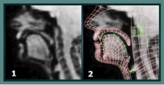
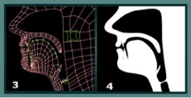

## Dynamic Dialects

The Dynamic Dialects project at the University of Glasgow is an accent database, containing an articulatory video-based corpus of speech samples from world-wide accents of English, revealing the hidden workings of our tongues and vocal tracts using 1,500 ultrasound videos. The project used Ultrasound Tongue Imaging Equipment to show how the hidden mechanics of our lips and tongues combine to produce the distinct accents from different speakers of English around the world. The project looked at native English speakers from 48 regions and 16 different countries around the world, building up a comprehensive picture of how and why different accents of English are distinct from one another. The publicly accessible corpus will a valuable teaching tool for speech and language professionals, as well as a resource for future study by teachers, students and researchers of phonetics.

The videos in the Dynamic Dialects accent database include sets of 27 reference words, along with and a brief sample of spontaneous conversational speech from each speaker. The ultrasound videos have been synchronised with audio and video of moving lips, providing a much clearer view of the precise mechanics of how speech is produced. Currently the project has imaged English speakers from UK, Ireland, USA, Canada, India, New Zealand, Australia, Singapore, Sri Lanka, Hong Kong, Malaysia, Zimbabwe, Nigeria, Tanzania, Trinidad and the Philippines. A related phonetics teaching resource, Seeing Speech, contains 360 moving 2D videos showing the inside of the vocal tract. The videos were obtained using ultrasound tongue imaging and magnetic resonance imaging technology. 

These two video-based corpora, Dynamic Dialects and Seeing Speech, will provide a unique and extensive visual resource for the study of speech production and will be key resources for both students and teachers of linguistics and speech therapy.

Project website: http://www.dynamicdialects.ac.uk/

Research team: University of Glasgow: Jane Stuart-Smith; Satsuki Nakai; Eleanor Lawson; Flora Edmonds; Iain Edmonds; Queen Margaret University: James Scobbie; UCL: David Beavan; Napier University: Gregory Leplatre

_Image1:Use of ultrasound scans in Dynamic Dialects: (1) mid-sagittal MRI frame of the model-talker’s head, (2) animation rig superimposed on the MRI frame_

_Image2:Use of ultrasound scans in Dynamic Dialects: (3) animation rig, showing control points (4) final black and white animation_

[back](./)