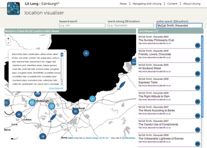

#Palimpsest: an Edinburgh Literary Cityscape#

The Palimpsest project was an experiment in rewriting familiar stories, and remapping a familiar topography. Miranda Anderson, who later worked on the project as a research fellow, was its originator – and it began as a way of digitally marking the 250th anniversary of the formal study of literature in English at the University of Edinburgh. In 2012, we created a small-scale prototype which allowed users to explore a small selection of geolocated extracts from literary works which used Edinburgh’s famous Royal Mile as their setting.

This was fine, and fun, but there was a problem. It took a volunteer group of researchers many hours to curate even the four hundred extracts in the original database - the creation of metadata, and the geolocation of extracts, had to be done manually. The experience for users was therefore rather limited, and the encounter with the literary city was correspondingly constrained. What would it be like if users could be presented with a much larger corpus of extracts, which drew on a much wider and deeper array of literature that made use of Edinburgh as a setting? And how could this possibly be accomplished, given the time intensity of manual data creation?

So we put together a larger team, bringing together literary criticism, text mining, geoparsing (University of Edinburgh and EDINA) and innovative visualisation (St Andrews), and scaled up the project. Now, we were working with very large corpora of digitised texts, such as those available from the British Library, HathiTrust and Project Gutenberg. We planned to automate the processes of text selection and extract geolocation, and offer users different ways to interact with the resulting mapped data. 

Firstly, we mined these large collections, extracting narrative texts with a reasonable density of Edinburgh place-names; then, we analysed these texts using a specially constructed fine-grained gazetteer, capable of attributing geospatial coordinates to a wide variety of different kinds of place-names – those of streets, areas, houses, institutions, pubs, even statues. We built an interface that allowed us to check our results and refine our methods of searching – so we were able, for example, to downweight texts featuring place-names that were either ambiguous or unlikely to be Edinburgh-specific.

We called what resulted LitLong: Edinburgh – viewable at litlong.org. At its heart was a dataset of more than 47,000 extracts from more than 550 books, featuring over 1,600 different Edinburgh place-names. To help users explore this collection, we created two visualisations: the bird’s and the frog’s eye views. Our Location Visualiser allows users to focus their exploration by selecting keywords, authors or places, or by zooming in and out of a map of the city. The books including the relevant terms are listed, and extracts focused on place-names can be viewed. Our mobile app, by contrast, allows users to put themselves right in the heart of the literary cityscape, to select locations nearby or further away, and to see the extracts which refer to that location.

This is not the usual way of reading a city’s literature, or a literary city. We don’t privilege a few famous books or writers at the expense of everything else, so you will find celebrated extracts from canonical works overlaid by moments from long forgotten novels or memoirs. Our results are generative – not focused on producing a single graph or fixed set of analytical relations, but open-ended, encouraging users to play around with and explore the data. We want people to find entirely unexpected paths through the city and the writing it’s provoked, rather than just follow the most well-trodden. We want our users to register just how choral the anthem of a city turns out to be.

Research team: University of Edinburgh: James Loxley, Jon Oberlander, James Reid, Aaron Quigley, Beatrice Alex, Miranda Anderson, Ian Fieldhouse, Claire Grover, Nicola Osborne, Lisa Otty, Tara Thomson, Vasilis Karaiskos; University of St Andrews: David Harris-Birtill; Uta Hinrichs.

_Image1: The literary landscape of Edinburgh as it appears in Litlong.org_

_Image2:Launch of LitLong: Edinburgh in March 2015_

