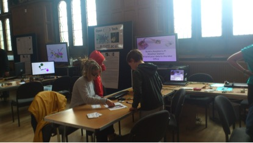

## The Secret Life of a Weather Datum

Putting ‘big’ weather data in the spotlight, _The Secret Life of a Weather Datum_ project sought to develop a new approach for understanding and communicating how human cultural values and public policies interact with data practices to shape the production, processing, distribution and use of weather data. Over the course of 18 months, the research team followed the journey of a single temperature datum produced at the Weston Park Weather Station in Sheffield, on into the Met Office and two cases of re-use: climate science and financial markets. The team also explored their datum’s intersection with data produced by amateur observers and citizen scientists engaged with the innovative and highly celebrated Met Office projects _Weather Observations Website_ (WOW) and _Old Weather_. At various sites along this journey, the team stopped off to collect interview, observational, photographic, digital ethnographic and documentary data that they used to explore the human values and practices that interact with the data, and the policy and governance structures which shape its journey.

From this research an interactive public website and open research data archive has been developed at lifeofdata.org.uk that allows members of the public to follow the journey of the weather datum and explore the data practices, human values, and public policy issues uncovered at different sites. Drawing on the metaphor of an underground map, the visualization presented on the website aims to draw attention to the socio-technical infrastructural conditions that the data journey is embedded within. 

The team also embedded themselves directly in the data journeys they explored, building their own Raspberry Pi weather station and sharing their temperature data directly to the Met Office WOW project *(http://wow.metoffice.gov.uk/weather/view?siteID=878216001)*. Public engagement activities based on the Raspberry Pi weather station were rolled out to over 250 people of all ages at events around the country, including the V&A Digital Design Weekend, Manchester Girl Geeks Christmas Party and the University of Sheffield’s Festival of the Mind. Each of these individuals had the chance to put together their own Raspberry Pi weather station, write some basic code, and transmit a temperature observation directly to the Met Office WOW website.

Research team: University of Sheffield: Jo Bates, Paula Goodale; University of Creative Arts: Yuwei Lin.

_Build your Own Raspberry Pi weather station_

_The Secret Life of a Weather Datum project at the Manchester Girl Geeks_

[back](./)