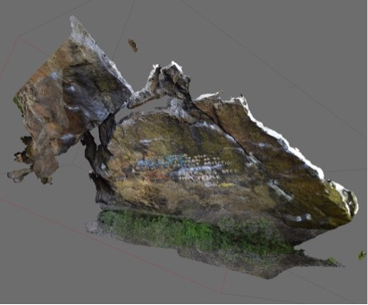

##Stories ACCORDing to Communities

The AHRC funded ACCORD project examined multiple aspects of digital recording and visualisation technologies through community engagement and the co-production of 3D models of monuments and places. An important aspect of this was documenting the perceptions that communities have of the digital recording process and their relationship with heritage practitioners, and how they value the resulting digital visualisations we made together.

The ACCORD project was based at the Digital Design Studio in the Glasgow School of Art, with partners at Archaeology Scotland, the University of Manchester and the Royal Commission on the Ancient and Historical Monuments of Scotland (RCAHMS). Over the summer of 2014 we worked together with ten community groups across the length and breadth of Scotland, created over 25 GB of data including seventeen 3D photogrammetric models and twenty three Reflectance Transformation Images and a very active blog, with over 5,000 hits *(https://accordproject.wordpress.com/)*. The ACCORD archive will shortly go live on the Archaeology Data Service *(http://archaeologydataservice.ac.uk/)* where it will be freely available under a Creative Commons License. We are the first project in Scotland to create such a varied resource of 3D digital data of all types of heritage (from rock-art to rock-climbs) chosen, designed and made by communities themselves. 

It has become clear that deploying these technologies can be an empowering process for communities with regard to a sense of ownership of their heritage, and in many cases stories and perspectives which are not apparent in expert led discourses emerged from our co-production methodology. We believe these technologies and co-production approaches have the potential to change the landscape of heritage as currently practiced. In the following paragraphs we briefly tell the story of one community group and their site of interest.

The ACCORD team worked with a group of rock-climbers at the site of Dumbarton Rock from 8 to 10 July 2014. Dumbarton Rock is a volcanic plug positioned where the River Leven meets the River Clyde in West Dumbartonshire. The rock has a rich history extending back to at least the sixth century AD, when it was reputably the centre of the ancient Kingdom of Strathclyde. Dumbarton Castle has an individual record in the RCAHMS database (Canmore ID 43376) and the remaining seventeenth-eighteenth century buildings, and the volcanic plug on which they sit, are a Scheduled Ancient Monument. The scheduled area also encompasses the foot of the rock and a series of well known and well used climbing boulders and rock faces. The legal designation primarily concerns the historic buildings atop the cliff-face and there is no mention of the modern sporting heritage on which our engagement focused.

This place is known as ‘Dumby’ in climbing circles and is a renowned venue which has played a large part in the history and development of the sport in and beyond Scotland. The climbers who worked with ACCORD represent a locally based climbing community of interest, including those who have played a leading role in promoting the climbing scene at the site. Together we recorded and modelled the cliff face in the north-west sector of the Rock, focusing on the most famous climbing routes, as well as historic graffiti and some of the smaller boulders. 
The process of recording and modelling these aspects of Dumby has had a demonstrable impact on how it is valued as a contemporary sporting heritage site by both climbers and, importantly, heritage professionals. The highly detailed and accurate representations achieved were considered by the group to be a valuable archive solidifying and legitimising the status of their climbing heritage. Following on from the fieldwork, the climbers have co-written an academic conference paper and have been invited to contribute a section on the climbing heritage to the official Historic Scotland Statement of Significance for Dumbarton Rock. 

Research team: Digital Design Studio, Glasgow School of Art: Stuart Jeffrey, Mhairi Maxwell; Royal Commission on the Ancient and Historical Monuments of Scotland: Alex Hale; Archaeology Scotland: Cara Jones; University of Manchester: Sian Jones 

_Image1: John Hutchinson (Dumby climber) and Siân Jones (University of Manchester) discussing how to go about capturing the data_

_Image2: A photogrammetric model produced by the Dumby climbers with ACCORD of the ‘Pongo Boulder’_

[back](./)