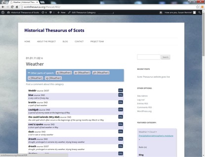

## A Pilot Historical Thesaurus of Scots

This pilot project is developing the methodology for creating the first _Historical Thesaurus of Scots_ (HTS), by mining the online _Dictionary of the Scots Language_ (DSL) for data and then categorising it into semantic fields. By these methods, we aim to provide a semantic map that will allow users to navigate and explore the DSL in new ways. It is important to our work that we engage not only with researchers, but with the wider, non-academic community, so that a future HTS can serve the needs of a varied set of potential users.  

A key object of the pilot has been to assess the potential for future collaboration, especially with non-academic organisations. In this respect, the timing of our project has been fortunate, as it has coincided with two key initiatives in Scottish Education. In 2014, the Scottish Qualifications Authority (SQA) launched a new Award in Scots Language, aimed at secondary schools and intended to ‘provide opportunities for learners to study the history and development of the Scots language’ and to ‘develop their ability to understand, and communicate in, Scots’ (*http://www.sqa.org.uk/sqa/70056.html*). At around the same time, Education Scotland appointed four Scots Language Co-ordinators to support the teaching of Scots across the curriculum. The success of both of these initiatives will rely on the availability of high-quality resources to support teachers and learners, and the HTS is ideally placed to supply this. We have already established strong links with both the SQA and Education Scotland. In June 2014, we were invited to showcase our project to teachers at the launch of the new SQA Award, and we are delighted that the pilot HTS is now cited as a recommended resource in the Assessment Support materials which the SQA provides to centres. 

We expect, therefore, that teachers and secondary pupils will access our Thesaurus directly for resources and inspiration; but we are also keen that our data is accessible to earlier years, and this is where our second collaboration is particularly exciting. In 2015, we began a ‘pilot within a pilot’, to assess the potential for using HTS data to produce materials for primary and lower secondary education. We are currently working with the new Scots Language Co-ordinators at Education Scotland to produce customised versions of our raw data, in the form of simple spreadsheets, which they can then use to produce ‘word mats’ featuring categories of Scots vocabulary. We have chosen initially to focus on weather: a subject of perennial interest to all ages in Scotland! The materials we develop with Education Scotland will be launched at the Scottish Learning Festival in September 2015, and to complement this, we will be presenting two workshops on using the HTS to teachers at a special Education Scotland conference that month.

William Grant, the founding Editor of the _Scottish National Dictionary_ was a committed educator and firm believer in the importance of involving the public, and especially schoolchildren, in the work of the dictionary. ‘In the scholar,’ he wrote, ‘we behold the future citizen, the future worker in every department of human activity.’ The HTS project works in the same spirit. We intend that the collaboration with educational bodies will continue alongside our compilation. Nor is this merely a one-way relationship. Our discussions have already led us to tweak the design of our website and we look forward to the input of teachers and pupils in our user trials later this year. We see the collaboration with Education Scotland as a model for our future project, where both sides provide their individual expertise to provide maximum benefit to the public, while retaining the research integrity of our project. 

Research team: University of Glasgow: Susan Rennie, Magdalena Warth-Szczyglowska

_Image1: Pilot website and blog of the new Historical Thesaurus of Scots (www.scotsthesaurus.org), which will soon be able to accept photographs submitted by users to illustrate Scots words and phrases_

_Image2: Magdalena Warth-Szczyglowska, discusses weather terms from the new Thesaurus with Scots Language Co-ordinators from Education Scotland_

[back](./)