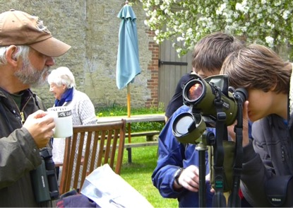

#The Ethno-Ornithology World Archive Takes Flight#

_Image: Watching the rookery at Kelmscott Manor. EWA Director Dr Andrew Gosler, Oxford University, tells two of the Young Carers about the former use of rook chicks as food in England  (Photo: Roberto Thomson, Oxford University)_

Everyone loves birds! So said Henrik Moller in a chapter by that name in Ethno-ornithology: Birds, Indigenous Peoples, Culture and Society (eds. Sonia Tidemann and Andrew Gosler). The importance of this near-universal truth, that humans everywhere find meaning through a relationship with birds, has gone largely unrecognised by a conservation community whose work is framed largely within a scientific paradigm. It was to address this shortcoming that the Ethno-ornithology World Archive (EWA) is being created. EWA is an internet-based, public-facing archive of global cultural knowledge relating to birds, initiated with financial support from an AHRC Digital Transformations in Community Research Co-Production grant. EWA represents a collaboration between Oxford University’s Edward Grey Institute of Field Ornithology and the Institute of Human Sciences, in the Department of Zoology and School of Anthropology and Museum Ethnography respectively, BirdLife International (the world’s largest conservation NGO working in more than 120 countries), and the Spanish natural history publisher Lynx Edicions. The purpose of EWA is multifarious. It is a community-led archive of traditional ecological knowledge. It is a research tool of unparalleled potential through which anthropologists, linguists, ornithologists, ethnobiologists and conservationists can discover the bird knowledge of people across diverse cultures and languages. It is a public window through which both birds and the ways people relate to them can be discovered and celebrated. EWA is also a game-changer as it affirms the value of peoples’ local bird knowledge and how their environment is changing.

The EWA site is currently being beta-tested by individuals and communities across five continents, prior to going live at http://www.ewa-archive.net. Although not yet live, EWA has already inspired initiatives in community outreach within the UK. One such is the FLIGHT (Facilitated Learning Inspired by Grounds, Heritage and the Thames) project, developed through the Social Sciences Division of Oxford University. In late April 2015, EWA formed the focus for a consortium with the Department of Continuing Education and local heritage companies Salters Steamers (http://www.salterssteamers.co.uk/), Kelmscott Manor, the former home of William Morris (https://www.sal.org.uk/kelmscott-manor), and Compton Verney (http://www.comptonverney.org.uk/), to develop a two-day adventure discovering natural heritage and the cultural heritage it inspired for ten male Young Carers (15-16 years) who had been identified as potential NEETS (NEET is an acronym for Not in Education, Employment or Training). 

Starting at Tadpole Bridge, Oxon, the trip took the participants on a boat ride up to Kelmscott Manor, during which the Young Carers each received a bird book and binoculars and instruction in how to use them as they discovered 25 species of birds along the river. At Kelmscott they learned about William Morris and discovered his bird-inspired art and design, more birds nesting in the gardens, and how to make their own prints. The adventure moved to Compton Verney, where the Young Carers spent a night under canvas, discovered bird-ringing, and the remarkable antiquities (bird-related and otherwise) of the Compton Verney collections, as well as being very well fed! Only time will tell whether this introduction to nature and nature-inspired art, design and culture, will make the lasting impression for good that was perceived by all on the trip, but on 1 May, Phil Hanaway-Oakley, who works with the Young Carers emailed the following:

‘I can't thank you all enough for this. It has already been remarked upon by parents and staff the change in attitude in the lads...’

He went on to report changes in the Young Carers ranging from improvements in independence and self-esteem, through literacy and numeracy, to an awakening of interest in birds, folklore, museums and gardening. The consortium hopes to work together regularly.

Research team: University of Oxford: Andrew Gosler, Felice Wyndham, Karen Park, Ada Grabowsa-Zhang, Heidi Fletcher ; BirdLife International: John Fanshawe

[back](./)