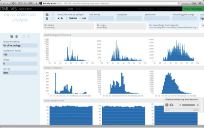

#Analysing Music Recordings from the British Library with the Digital Music Lab#

_Image: Digital Music Lab visualisations_

Music research, particularly in fields like systematic musicology, ethnomusicology, or music psychology, has developed as ‘data oriented empirical research’[1](#fn1)<a id="fnref1"/> , which benefits from computing methods. The AHRC Digital Transformations project _Digital Music Lab – Analysing Big Music Data_ has brought together researchers from Musicology and Computer Science from City University London, Queen Mary University of London and UCL, as well as the British Library and I Like Music Ltd., to develop methods and tools for analysing music data on a large scale. To this end we have developed and deployed an infrastructure of analysing large collections of audio and associated data. 

The British Library holds over 3 million audio recordings, about 10% of which are digitized, but a large part of the recordings is not copyright-cleared and not available or only for listening in the library. Our approach is therefore to bring the computation to the data, so that an automatic analysis can be done without having to be in the Library. We have developed an analysing facility at the British Library to demonstrate that a computational analysis of big music data is possible and useful. Our system includes currently about 59,000 tracks at the British Library, about half of which are world and traditional music and half are classical music. 

The automatic analysis is based on defining a collection, e.g. by recording dates, geographic information or other search terms. Then we run programmes that extract feature information for each audio recording, and aggregate the feature values for a collection. The aggregations can show information like the average tempo or the distribution of pitches (in high resolution). We support the creation of new collections, and by caching extracted feature data we enable efficient analyses so that users can quickly explore the available data. 

Apart from a more traditional text-based interface that enables logic-based queries we provide a visualisation-based approach. Here we specify selections by queries, apply different forms of feature analysis, and results are then displayed graphically in a grid with columns for selections and rows for features. This interface is implemented as a web application and can be accessed under *http://dml.city.ac.uk/vis*. Our illustration shows a screen shot from a visualisation of recordings of ‘Dinka’ music and for comparison recordings of ‘Soga’ music and all recordings from ‘Uganda’. 

We conducted a workshop at the end of the Digital Music Lab project where over 40 music researchers tested our system. The responses were very positive, indicating that musicologists appreciate the opportunity to evaluate digital audio collections graphically. In addition to the user interface, the results of feature extraction and aggregation are stored and published as Semantic Web data. The interoperability afforded by the Semantic Web technology enables the combination of data from different sources and different domains. For example, we could combine the observations of music pitch distributions in African musics with geographic and historic information from Wikipedia and other sources. Making computational analyses available and combining data and metadata across different sources enables exploration and new insight through the interaction with data. If these systems are further developed and deployed in libraries and archives, and if policymakers support the availability of open data for research, we can create exciting new tools for research on music and the humanities that enable findings that are next to impossible with traditional methods and resources. 

Research team: City University London: Tillman Weyde, Stephen Cottrell, Jason Dykes, Emmanouil Benetos;  Queen Mary University of London: Mark Plumbley, Simon Dixon; UCL: Nicolas Gold; British Library: Mahendra Mahey

<ol start="1">
<li id="fn1">Parncutt, R. (2007). Systematic musicology and the history and future of Western musical scholarship. Journal of Interdisciplinary Music Studies, 1, 1-32.<a href="#fnref1">↩</a></li>

[back](./)