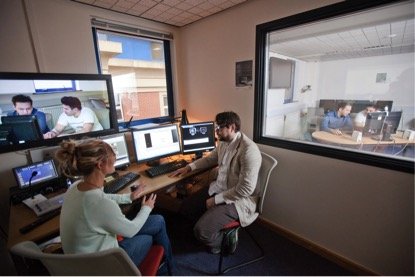

#Understanding the Annotation Process#

Data is being collected and created at the fastest rate in human history. The area of ‘big data’ is concerned with new techniques for making sense of this data. With the ubiquitous use of digital technologies, processing and interpreting big data sets is becoming more and more important in a huge range of fields. 

Many of the technologies associated with ‘big data’ and automatically understanding collection content are based on machine learning. Machine learning techniques generally involve a small training set which is used to train a machine learning system, after which the trained system can then be applied to a full data set. For example, a set of example images may be gathered which all represent a single ‘concept’ such as a person’s face. A machine learning algorithm can then be trained based on this training set, and then applied to a far larger number of images, to hopefully identify further examples of this individual. 

There is a huge quantity of ongoing work on machine learning, but far less work has gone into the process of creating the training sets which are used to train the automatic methods. This project has been investigating this less studied area: how can we most efficiently create training sets? The creation of training sets is, ultimately, a human endeavour, and one which the techniques and experience of the humanities can be brought to bear. 

The project has investigated how people judge a document’s relevance to a topic. One important component has been the use of crowd sourcing. Crowd sourcing platforms allow small jobs to be distributed to many individuals around the world who then work on the jobs for a small amount of money. Such systems, perhaps the best known of which is Amazon’s Mechanical Turk, are increasingly being used in the sciences and in industry to gather human judgements and integrate human knowledge into otherwise automatic analysis. Yet such systems have an achilles heel: crowd workers are remote and anonymous. The individuals who work in such systems may not engage fully with the jobs which they do, which has led to much work in detecting and removing poor quality work. 

One of the focuses of the project has been to investigate differences in judgement quality and assessment behaviour between crowd workers and those in more conventional experimental situations, such as someone who has been invited along to a lab. While techniques such as crowd sourcing allow the rapid gathering of judgements from hundreds or thousands of people, there is also a need to remind ourselves that each worker is a person (we assume: there is not necessarily any guarantee of even this!) Crowd sourcing distances the researcher from the individual participants, who are anonymous numbers behind a web interface.  

There is therefore a need to understand more about how individuals interpret the work interfaces we present to them through such systems.  An example of this from this project has been how different people interpret their ‘confidence’ in the judgement of whether a document is relevant or not to some topic. Through interviews with participants we have found that some interpret this as confidence in their knowledge of the topic, some as a proxy for how relevant a document is to a topic, among other interpretations. Such differences when studying individuals suggests that scale alone may not be enough: sometimes to better understand the big we must investigate the small. 

Research team: University of Sheffield, Information School: Simon Wakeling, Laura Hasler, Robert Villa; University of Strathclude, Department of Computer and Information Sciences: Martin Halvey.

_Image: The Understanding the Annotation Process project in the Sheffield iLab_
