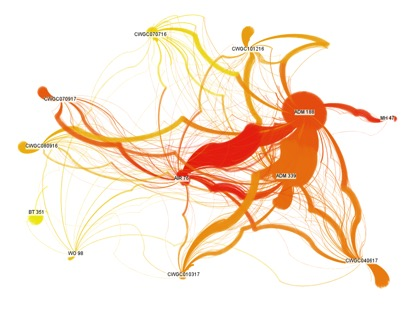
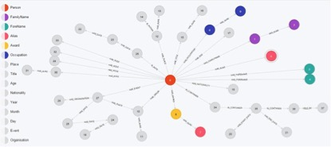

#Traces through Time#

Tracing the lives of real people, through time and across the documentary evidence that survives them is not easy. Working with historical data has many challenges and pitfalls: surviving records may be incomplete or unreliable; datasets are large and diverse. How do you know if the person you’ve found in one place is the same as the one you’ve found elsewhere? Yet it is these links and connections that tell the real story of people’s lives.

The _Traces through Time_ project has delivered practical analytic tools that allow researchers to trace and link individuals, with confidence, across ‘big data’ spanning over 500 years of British history, allowing people’s stories to emerge from the data.

One such story, which highlights social change as well as personal drama, emerges from the divorce records held at The National Archives (J 77)[1](#fn1)<a id="fnref1"/>. The data shows a surge in the divorce rate following demobilisation at the end of World War One. This prompted a change in the law and, in 1923, women were granted the right to petition for divorce on the grounds of their husband’s adultery. Exploring this dataset using the tools and techniques developed by project reveals a number of love triangles within these records, in some of which the ‘third party’ cited in one case re-appears in a later file as the newly divorced spouse!

In another example, linking names in the Commonwealth War Graves Commission’s database with appeals against conscription (MH 47)[2](#fn2)<a id="fnref2"/> has enriched our knowledge about the conscripted men who were killed in service – transforming ‘data’ into a view of individual lives. Looking at some of these links, the project team spotted a Mr Robert Fulwell Sawyer who appealed against conscription in December 1916, on the grounds that his family business, the Autotype company, would collapse without him. The CWGC database reveals that Second Lieutenant Robert Sawyer was killed in action in August 1917.
Mr Sawyer’s fears for the future of his firm were not realised and Autotype is still in existence today. The company’s website tells us that [the owner] ‘Charles Sawyer died in 1914 and his son was killed on active service in 1917’, validating our high confidence in linking these two records.

The Archives has a number of other files relating to Autotype, which have been linked to produce a network of connected records. One such record refers to an employee of the company, Frank Newens, a name that also appears in files asserting copyright over a range of photographs and also, as Frank Robert Newens, in the World War One service records (ADM 339 and ADM 337). These records state that Frank Robert Newens lived in Kew and worked for a bakery. That bakery exists today and its website has a photograph of the owner, Arthur Newens, with ‘…his son Frank, who distinguished himself as a photographer…’ confirming that the baker from Kew who served in the First World War was the same person as the photographer whose images are now part of the Archive collections.

Linking service records with non-military records produces more insights into the lives of men and women in wartime. Linking records from the Copyright Office (COPY 1) with service records for officers from the Royal Air Force (AIR 76) highlights the life of James Willis Grundy, a fellow of the Royal Photographic Society who went on to apply his photographic skills while in the Royal Naval Air Service (later, the Royal Air Force). Before the war, Mr Willis Grundy had been a prolific photographer of architecture in the city of Manchester and the Archives also contain rich examples of his work in peacetime.

These links were hidden within the millions of records held by the Archives, but were drawn together using the big data tools and methods developed by the project. Traces through Time makes it possible to ask interesting questions of data, both ancient and modern, and to explore it in ways that were not imagined when the records were created.

Research team: The National Archives: Sonia Ranade, Emma Bayne, Mark Bell, Matthew Hillyard; Institute of Historical Research, University of London: Jane Winters, Jonathan Blaney; University of Brighton: Roger Evans, Tony Russell-Rose; Leiden University: Arno Knobbe, Kleanthi Georgala, Benjamin van den Burg; University of Sussex: Lynne Cahill.

_Image1: Visualisation of links between people in different archival series from Traces through Time_

_Image: Visualisation of the Traces through Time data scheme_

<ol start="1">
<li id="fn1">http://discovery.nationalarchives.gov.uk/details/r/C9685 Court for Divorce and Matrimonial Causes: Divorce and Matrimonial Causes Files<a href="#fnref1">↩</a></li>
<li id="fn2">http://discovery.nationalarchives.gov.uk/details/r/C10890  Central Military Service Tribunal and Middlesex Appeal Tribunal : Minutes and Papers<a href="#fnref2">↩</a></li>
