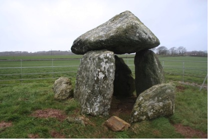
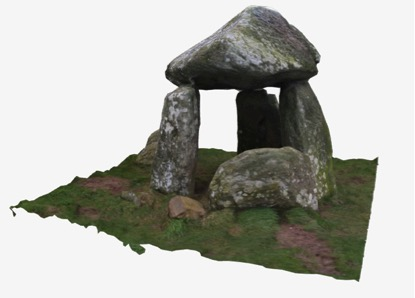

#Heritage Together#

In _Co-production of Alternative Views of Lost Heritage_ academics are working with heritage organisations and the public to capture alternative representations of our heritage. As such, we are doing  ‘heritage together’. By working together with the public, and getting volunteers to take photographs of these heritage assets, we are able to record our heritage. The project also aims to educate by working with schools in the Gwynedd, Anglesey and Ceredigion regions specifically, giving tutorials and presentations, running workshops and engaging with on-site heritage events. We have led the way with using multirotor UAV platforms to capture whole sites.

Using photogrammetry techniques, we utilise the ubiquity of the camera (in the hands of the communities) to photograph heritage artefacts and environments that are uploaded to our server, transformed to 3D models (through an automatic and online photogrammetry server), and stored in open file formats, with metadata. This process preserves ‘by record’ an archive of 2D photographs and 3D models of the heritage, metadata and their locations. 

Our focus is on megalithic monuments, such as burial chambers, standing stones and dolmen. Many of these monuments are at risk: they are disintegrating or eroding away. While heritage organisations do monitor sites, their monitoring is often informal and through photographic evidence. There is a limited set of resources to monitor and record these sites. By working with the public, we are able to capture and record many more of these sites than would be possible if it were merely an academic project. 

We encourage participants to ‘Go out on a free moment, and take photographs of heritage assets during their lunch break, over a weekend, or come up to Wales and make a specific holiday of it!’ This is transformative in that everyone together can help to capture assets in the field that can be kept and analysed in the future. We keep these results in a permanent digital archive, and make them freely available and reusable by everyone. We then can change these 3D models into different representation styles. Alternative views are important: a tangible 3D print of a standing stone can show rock art that cannot be seen on site; the tangible standing stone surrogate becomes a talking point at a workshop; the 3D models online can be evaluated by experts around the world; paper-cutout models can be glued together by children, while 3D printed puzzles of a standing stone can keep people busy for hours. Alternative forms afford different purposes. 

This is exactly what one couple did. They helped us capture the Bodowyr Burial Chamber. This is a Neolithic chambered tomb and Scheduled Ancient Monument in the care of Cadw, the Welsh government’s historic environment service. Like other community members of the project, they established the location of the site through the map on the website (HeritageTogether.org), visited the historic site on one Saturday, and took about 60 photographs of the burial chamber. After uploading the photographs, the heritagetogether system goes through a process of creating a point-cloud of overlapping points, 3D triangular mesh, before adding the texture and colour to the 3D model, and finally uploading it to the gallery. They were excited to manipulate the three-dimensional model. However, on viewing it they realised that it was not complete. They had omitted to photograph underneath the chamber and there were holes in the 3D model. They subsequently re-visited the site and took more photographs to gain a better model. The public made 257 photographs of the site, to generate the final 3D model.

Citizen science techniques have huge potential; not only do they enable many more environments to be captured but those involved learn about our history and heritage. Our project has created a huge database of over 85 3D models and over 11,000 photographs. Now, other scientific discoveries can be made from analyzing this data further. But researchers need new software systems to analyse and visualize this data, compare different locations and integrate it with other datasets. We have the opportunity to broaden the regions and make a national or international database of 3D models, capture different types of sensor data and represent this data in new and exciting ways. 

Research team: Bangor University, School of Computer Science: Jonathan Roberts; Andrew T Wilson; Bangor University, School of History, Welsh History and Archaeology: Raimund Karl; Katharina Moeller; Aberystwyth University, Department of Computer Science: Bernie Tiddeman; Frederic Labrosse; Helen Miles; Manchester Metropolitan University, Department of History, Politics & Philosophy: Ben Edwards; Seren Griffiths.

_Image1: Bodowyr Burial Chamber on Anglesey. Neolithic chambered tomb and scheduled Ancient Monument in the care of Cadw_

_Image2: 3D model of Bodowyr Burial Chamber on Anglesey, created by the community, modelled from 257 photographs_ 

[back](./)