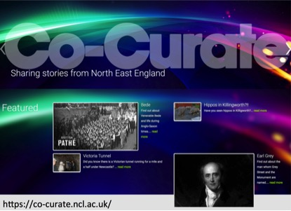

#Co-curating Big Data in the North East#

_Co-Curate North East_ was a project which sought to generate ‘unofficial’ knowledges from different types of collectives and communities in Northern England and mix and mash them with ‘official’ knowledges generated by big-memory institutions like museums and national collections. The project was about understanding vast circulations of digital objects, stories and ideas, but also about how we can jointly curate them with varied partners. We searched, we archived, we curated, we exhibited, we learned. But that ‘We’ was always a complicated thing. Not only was Co-Curate a transdisciplinary project including researchers and designers from Medical Sciences, Music, Heritage Studies, Education and Computing, working with a significant number of museums and their collections, but it was also involved co-production with its community partners. There was no model for this but practices, conversations and convivialities emerged. It was essentially about the co-production of a new social and digital machine enmeshed in all kinds of social relationships and networks. 

In the midst of this exciting project, perhaps the most challenging aspect was working with Big Data with a ‘Big Group’ – a collective of designers, archivists, social researchers, marketing specialists, education officers, museologists, artists and computing specialists. This collective was a whole Year 7 group of 230 students at George Stephenson High School at Killingworth in North Tyneside. As part of their I-learn programme, led by teacher Phil Robinson, they developed not just materials to go on the website but the website and software itself, new methods for approaching digital archives, and innovative ways of presenting data in multiple formats. Each of the 10 classes chose a theme for the final exhibition held at the Great North Museum at Newcastle. Teachers, university researchers, museum staff from Tyne and Wear Archives and Museums, and a graphic designer supported their work on the Big Data of Tyneside stories. Themes included George Stephenson, Souter Lighthouse, Newcastle United Football Club, migrating surnames of Tyneside, the history of Fenwick, Tyneside traditions, coal and mining histories, Tyneside manufacture, and Tyneside timelines. We also had a lot of interest from media around the intergenerational work of the groups, including the reuniting of old friends from historical photographs (The Wallsend Four), family memories of Kenton comprehensive, and Killingworth Park flats. The Big Data in each of the themes was presented in new visual formats and patterns that reflected some of the design ideas the groups had been working with, including typography and photographic information. The data on migrating surnames of Tyneside was particularly exemplary as its visualisation technique was embedded in geographical routes and origins.

Aside from co-producing exhibitions with museum professionals and curators, the students also had the chance to learn more about the kinds of information, designs and knowledges that inhabited university and gallery spaces. They worked with the researchers and with the Hatton Gallery around exploring the artistic and architectural vision of Victor Pasmore, learned about the influence of Kurt Schwitters and the Merz Barn Wall on Basic Design techniques and looked at the influence of architects like the firm of Ryder Yates on the estates and houses which they live in today in Killingworth. These knowledge exchanges and circulations were part of the navigation through and production of the social machine of our Co-Curate digital platform and its resources. The digital platform has the potential to stream, mesh and reassemble tens of thousands of resources in new narrative directions. The capacity to ‘re-story’ Big Data through co-curation and exhibition has now become part of the technological and cultural landscape of the school, its work on product design, and the futures of its research practice. Linking microscopic local stories and resources with vast and often abstract social forces, our new social machines can transform our understanding of digital historical and archival practice.

The Co-Curate website is: https://co-curate.ncl.ac.uk

Research team: Eric Cross, Martyn Hudson, Katherine Lloyd, Gerard Corsane, Andrew Newman, David Leat, Lucy Tiplady, Ulrike Thomas, Jill Clark, Simon Cotterill, Paul Watson, Phil Heslop; Tyne & Wear Archives & Museums: John Coburn; Woodhorn Museum: Liz Ritson

 

_Images: Some of the most popular media from the Co-Curate project_
