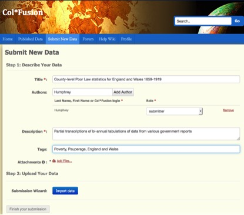

## Statistics and ‘Big Data’ in the Humanities

Has ‘Big Data’ made traditional statistical methods irrelevant? Traditionally statistics are about careful counting, early issues of the Journal of the Statistical Society describing counts of everything from people by the Census to bees in an amateur statistician’s garden. The introduction of Civil Registration in 1837 required a new network of officials but then provided a new understanding of diseases both epidemic and chronic.

Today, ‘Big Data’ techniques are developed by mathematicians, computer scientists and a new breed of ‘data scientists’, who do not gather data through fieldwork but mine existing assemblies of information, using techniques focused not on counts but on less structured text, images etc., for example, detecting flu epidemics by analyzing Google searches. Such methods are politically attractive as they are cheaper, quicker and less intrusive than traditional surveys: the 2011 Census cost £480m, the first results took fifteen months, and if only c.200 people were prosecuted for actively refusing to respond, many more quietly ignored it.

Despite these attractions, ‘big data’ methods struggle to replace traditional methods, so Google Flu Trends quickly tells us an epidemic is happening, but cannot accurately identify timing or intensity. Instead, traditional statistical methods are absorbing elements of ‘big data’: despite political hostility, we are starting to plan the 2021 UK census, but form completion will be primarily online and supplemented by mining of administrative data.

Most social scientists can rely on census and other official data being freely downloadable under open licenses. Conversely, most historical statistics exist only on paper. Three projects have greatly improved digital availability of UK historical statistics but all have limitations:

* The History Data Project sought out and assembled data sets computerized by academic researchers, but many were problematic and minimally documented.

* Essex’s Historical Population Reports system (www.histpop.org) makes scanned images of c. 200,000 pages from original reports available online, preserving the data’s historical context but providing little help with finding the particular number needed.

* The Vision of Britain system (www.VisionOfBritain.org.uk) individually contextualizes data values, identifying source, date, location and what is being measured. This enables data from many separate censuses to be accessed as local time series, but adding that context is time consuming, limiting our content to c. 14m. data values.

This made collaboration with the Collaborative for Historical Information and Analysis (CHIA; www.chia.pitt.edu), funded by the US National Science Foundation, attractive. Like the History Data Project, CHIA aimed to gather statistical transcriptions from individual academics, but through on-line crowd-sourcing, enabling researchers everywhere to contribute to a global archive. Further, it aimed not merely at assembling datasets in a repository but ‘fusing’ them into a single meta-dataset, enabling new analyses of longer time periods or larger geographical areas.

Here, unfortunately, the notion of ‘big data’ as a revolution, making existing good practice irrelevant, became a major problem. The original CHIA proposal was prepared mainly by historians, including historical GIS specialists, and drew heavily on Vision of Britain’s data model, based in turn on the Data Documentation Initiative’s work (www.ddialliance.org). However, CHIA’s Col*Fusion system was developed by computer scientists who rejected that model, instead storing each uploaded Excel spreadsheet as a separate database table. ‘Fusion’ was defined as identifying similar columns in different tables through ‘lexical analysis’, but in practice datasets contained too few words: the only commonalities reliably found were placenames. ‘Big data’ takes data as it finds it, but in practice Excel transcriptions can be made meaningful only with additional information, existing in either contributors’ heads or images of the historical sources.

Current work focuses on enhancing Vision of Britain using insights gained through collaboration with CHIA.

University of Portsmouth: Humphrey Southall

[back](../)
