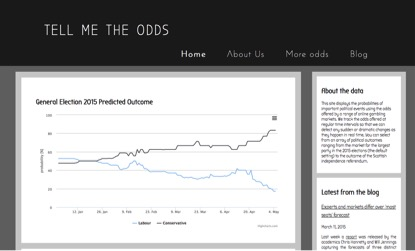

## What are the odds? Capturing and exploring data created by online political gambling markets

The idea driving the _What are the Odds?_ project is that online gambling markets with explicitly political outcomes can provide both social scientists and members of the public with novel data on unfolding political dynamics in real time.  At the beginning of the project, the potential of the data created by online political gambling markets was under-developed. While the odds on specific events were available for those who chose to search them out online, they were neither explored over time nor represented as underlying probabilities. 

The goal of the _What are the Odds?_ project team was to perform the tasks of capturing, interpreting and visualising the data created by online political gambling markets , with a view to creating a website that would be a public and academic resource which could enhance our understanding of the dynamics of political probabilities – focusing particularly on  elections.

The project website, *www.tellmetheodds.com*, represented the culmination of our work towards these ends. The site’s creation and the coverage that it provided of the 2015 UK general election are the highlights that we have chosen to reflect upon in this piece.

The website itself sits on top of a bespoke data collection tool, which captures and records odds from online gambling sites on political outcomes. Once the data collection tool was running reliably on our project’s server machine, a second step involved bringing together all of the prices available from the twenty plus companies offering political gambling markets, and converting these into a single underlying predicted probability. The next step involved choosing a visualisation tool capturing over-time shifts in the probabilities of events in our selected markets. Finally, we had to undertake a variety of tasks, from the rather prosaic matter of creating and purchasing a domain name to more complex decisions about how best to nest our data capturing multiple political markets within a navigable and visually appealing site design.  

Following a period of beta testing during the Scottish Independence Referendum, the full site went online in early 2015, allowing us to capture the dynamics of one of the most fascinating political campaigns of modern times: the 2015 UK General Election. Apart from relief that all of the constituent elements underlying the site were functioning reliably, our principal emotions were amazement – it seemed that the gambling markets were telling us a radically different story to mainstream coverage of the campaign, which held that the race between Labour and the Conservatives was ‘too close to call’. From mid-January onwards, the dynamics of the ‘largest party’ market that we featured on the site’s homepage told a consistent story: the Conservatives were perceived as more and more likely to be the largest party – a trend that particularly accelerated in the final weeks of the campaign. As we now know, the eventual results gave the Conservative Party a majority of seats – confounding the predictions of most pundits and pollsters. 

Thus the creation of the *www.tellmetheodds.com* website represented a highlight in its own right – as a proof of concept that gambling odds on political events could be captured and visualised online in real time. However, the data that we captured and visualised also represented a highlight, suggesting that the gambling markets provided insights that were largely missed in the poll-based coverage of the unfolding campaign that lead so many to be shocked by the eventual election result. 
Research team: University of Swansea: Matthew Wall, Stephen Lindsay, Robert Rokosz; University of Limerick: Rory Costello

_Image: Projections of outcome of 2015 General Election derived from online gambling data, as shown on the project website, tellmetheodds.com_ 

[back](./)