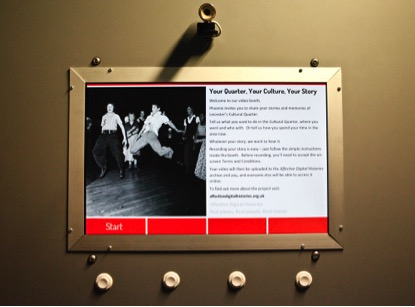
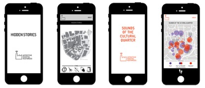
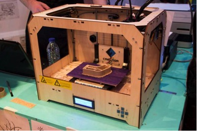

## Affective Digital Histories: Re-interpreting De-industrial Places, 1970s to the Present

The project investigated the dramatic changes in how people lived, worked and played in some of Britain’s most under-researched de-industrial sites of the 1970s, 80s and 90s.  While the decline of British manufacturing in the late twentieth century is well-documented, the stories 'out there' have not been told or researched for what they can tell us about people's emotional 'feel' for a place that they and their community might have been part of. These stories form an important tapestry of information about how certain communities think about, feel and use physical spaces that have undergone regeneration in recent decades. In Leicester, for instance, these include dance halls, rave venues and alternative clubs for a variety of uses.

What did these community ties, activities and experiences of diverse ethnic, racial and cultural groups in these periods look like? Sound like? Feel like? Such questions have never been posed by researchers or to audiences alive today.  Historical data have been captured only haphazardly till now, leaving behind fragmented and inchoate traces in different archives.  This study sought to ask bold, ambitious and provocative questions about how the silence surrounding this period in British industrial history can not only be revitalised but transformed utterly through digital co-creation and co-curation of existing archival assets between communities, businesses, artists, academics and city and county councils.

Thus the journey began. Over 19 months beginning in October 2013, two sites – the Cultural Quarter in Leicester and old mills, town halls and a library in the Howard and Whitfield wards of Glossop (Derby/Manchester) – were re-imagined through creative writing commissions, live performances, print workshops, 3D visualisations, film, sound trails, an interactive mobile video booth and a book of poems, plays and stories.  

Public events, workshops and focus groups brought these digital assets to life, beginning to end and to new beginnings. The affectivity of these innovative methods was captured ultimately by a series of digital apps on the Empedia platform, which were open access, crowdsourced,  renewable, and endlessly open to new interpretations. Bringing together a truly multidisciplinary team from Geography, the Centre for New Writing (School of English), Museum Studies, Oral History, Urban History, Special (digital) Collections (David Wilson Library) and the School of Management allowed multiple methods and ontologies to flourish. To date, over 2000 downloads of the app have been recorded and sales of the book are flourishing. The project has been covered by BBC East Midlands, the Leicester Mercury, BBC Radio Leicester and numerous press releases in regional media.

Research team: University of Leicester: Ming Lim, Corinne Fowler, Martin Phillips, Giasemi Vavoula, Simon Dixon, Amy Jane Barnes, Colin Hyde; De Montfort University: Nick Higgett; University of Glasgow: Rebecca Madgin; Phoenix Arts, Leicester; Cuttlefish Multimedia; Glossop Heritage Trust; High Peak Community Arts

_Image1: Video booth from Affective Digital Histories, showing a photograph of jive dancing in a Leicester venue_

_Image2: Apps produced by the Affective Digital Histories project_

_Image3: 3D printing of woodblocks designed by members of the public in the New Incunable Print Shop, part of the Affective Digital Histories project_

[back](../)
