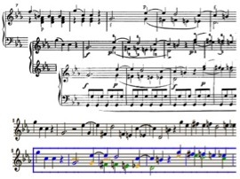

## Optical Music Recognition from Multiple Sources

Optical Music Recognition (OMR) is the process of taking information from scans of musical scores in order to know what notes they contain, equivalent to the process of Optical Character Recognition (OCR) which reads the words in scanned text. Software for OMR has existed for several decades, but it remains quite inaccurate (like early OCR software) and the output requires a lot of correction. What is different now from the time when OMR software was first written is the quantity of data: many scans are easily available from on-line libraries such as the Petrucci Music Library (imslp.org). For pieces of music by famous composers, scans of several different editions of a work are often available, and sometimes there are scans of parts as well as scores. 

One way of exploiting this wealth of data is to take the output from OMR software when applied to several sources of the same piece, and to combine it so that the mistakes in one output are corrected by information from another output. This project developed and tested a software pipeline which took a set of scans of a piece of music, pre-processed the images to split them into sections and remove the most common causes of errors in OMR, ran four commercial OMR programs on those images, and combined the outputs to produce the most accurate result possible. Where appropriate, the process also combined information from OMR on scans of parts (which have fewer notes and so are generally recognised better) with outputs from a scan of the full score. To make an effective combination process, we had to overcome two particular problems. Firstly, notes or entire bars would be missing from one output or another and sometimes extra bars would be inserted, so we had to learn how best to align the outputs so that we could know where they did and did not agree. Secondly, we had to learn how to determine the most likely correct output at points of disagreement. In the solution of both problems, we applied techniques used in the processing of genetic sequences: the Needleman-Wunsch algorithm for alignment and similarity through phylogenetic trees for discounting the least accurate outputs. There were also particular problems to be overcome in the arrangement of notes in multiple voices in piano music.

Our tests, on string quartets and piano sonatas by Mozart for which ‘ground truth’ data in the form of files in MusicXML or some similar format are already available, indicate that we are able to halve the number of errors in pitch and rhythm which typically result from applying a single OMR program to a single scan of a score. This is considerable improvement but the typical accuracy rate is still only 95%, and we ignore information in the score which does not concern pitch and rhythm. Thus, while we believe that our research will make the creation of large databases of music for computational processing more realistic, it does point out the distance still to cover before OMR can be used on a truly massive scale with minimal human input, as OCR is now used regularly in projects such as Google Books. It is our belief that we will not reach this point without a fundamental revision of the way in which OMR software works, so that the vast quantities of information now available are exploited in OMR at a lower level rather than only in a post-hoc corrective procedure.

The software developed in the project is available at https://code.soundsoftware.ac.uk/projects/multiomr and at http://github.com/MultiOMR.

Research team: Lancaster University: Alan Marsden, Victor Padilla; University of Leeds: Kia Ng, Alex McLean

_Image: The process of optical music recognition applied to a musical score in the public domain_

[back](../)